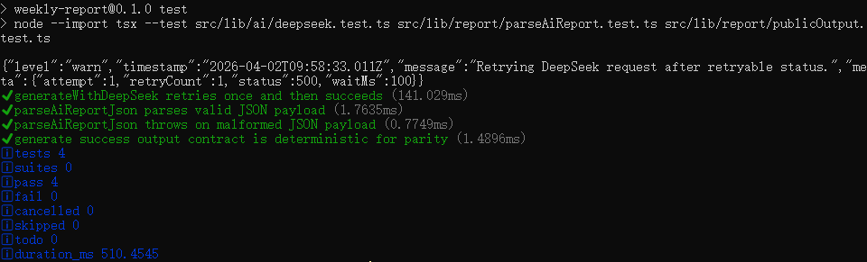

@AGENTS.md

CLAUDE.md
# 项目概览 (Project Overview)
Git-Weekly-Insight (weekly-report): 一个基于 Next.js 的自动化周报生成工具。
核心逻辑：自动扫描本地多个 Git 仓库的 Commit 记录，结合本地碎碎念笔记（Thoughts），调用 DeepSeek API 生成侧重业务产出的 Markdown 周报，并自动保存至输出目录。

# 技术栈 (Tech Stack)
框架: Next.js 15 (App Router)

语言: TypeScript (严格类型检查)

样式: Tailwind CSS

AI: DeepSeek API (使用 src/lib/ai/deepseek.ts 调用)

环境: Node.js (使用 child_process 或 subprocess 调用本地 Git)

# 目录结构 (Folder Structure)
src/app/api/weekly-report: API 路由入口 (Route Handlers)

src/lib/git: Git 仓库扫描与提交记录采集逻辑

src/lib/notes: 本地碎片化笔记读取逻辑

src/lib/ai: 大模型调用（DeepSeek）封装

src/lib/prompt: Prompt 构建与模板解析

src/lib/report: 周报编排、Markdown 格式化及文件落盘

src/types: 全局 TypeScript 类型定义

prompts/: 存放原始 Prompt 模板文件 (.md)

output/: 存放生成的周报产物

# 核心指令 (Core Commands)
开发模式: npm run dev

代码规范检查: npm run lint (提交前必跑)

构建项目: npm run build

文件检查 (Windows/PS): Get-ChildItem -Recurse -File | Where-Object { $_.FullName -notmatch '\\node_modules\\|\\.next\\|\\.git\\' } (替代 rg --files)

# 代码规范与最佳实践 (Code Style & Guidelines)
组件规范: 默认使用 Server Components；仅在需要交互时使用 'use client'。

逻辑分层: 业务逻辑必须封装在 src/lib/ 下的模块中，API 路由仅负责调度。

错误处理: 在 lib 函数和 API 路由中必须使用 try-catch 块，并返回清晰的错误信息。

配置管理: 所有敏感信息和路径配置通过 src/lib/config/env.ts 读取，引用 .env 变量。

导出习惯: 优先使用 具名导出 (Named Exports) 而非默认导出 (Default Exports)。

# 环境变量 (.env)
需配置以下关键变量：

DEEPSEEK_API_KEY: 必填，API 访问密钥。

WORK_DIR: 必填，待扫描的代码库根目录。

THOUGHT_PATH: 选填，个人笔记文件路径。

SINCE_DAYS: 默认 7，统计过去几天的提交。

# Project Guide: weekly-report

## 1) Project Overview
Git-Weekly-Insight (`weekly-report`) is an automation tool for generating weekly developer reports.

Core flow:
1. scan multiple local Git repositories,
2. merge commit history with local thought notes,
3. call DeepSeek,
4. output a shareable Markdown report in `output/`.

Primary product target from `SPEC.md`: CLI-first experience with one command to generate report.

## 2) Tech Stack
- Framework: Next.js (App Router, API route as adapter)
- Language: TypeScript (strict)
- Style: Tailwind CSS
- AI: DeepSeek API (`src/lib/ai/deepseek.ts`)
- Runtime: Node.js (`child_process` for local git log)

## 3) Architecture (Layered)
- Presentation: CLI (`src/bin/cli.ts`) and API (`src/app/api/weekly-report/route.ts`)
- Application: `src/lib/report/generateWeeklyReport.ts` orchestration
- Domain: prompt/report composition, result model, warning strategy
- Infrastructure: git scanning, file I/O, DeepSeek HTTP call, env loading

Rule: business logic lives in `src/lib/**`; route handlers and CLI remain thin adapters.

## 4) Folder Responsibilities
- `src/bin`: CLI entry and command dispatch
- `src/app/api/weekly-report`: HTTP adapter
- `src/lib/config`: environment loading/validation
- `src/lib/git`: repository scan + commit extraction + repo-level warnings
- `src/lib/notes`: local thought note reader
- `src/lib/ai`: model invocation
- `src/lib/prompt`: prompt composition
- `src/lib/report`: orchestration, markdown naming, file write
- `src/types`: shared contracts
- `prompts/`: prompt templates
- `output/`: generated markdown artifacts

## 5) Commands
- `npm run dev`
- `npm run lint`
- `npm run build`
- `npm run report -- help`
- `npm run report -- check-config`
- `npm run report -- dry-run`
- `npm run report -- generate`
- `npm run test`
- `npm run test:e2e`
- `npm run test:e2e:api`
- `npm run perf:check`

## 6) Environment Variables
- `DEEPSEEK_API_KEY`: required for `generate`
- `DEEPSEEK_MODEL`: optional, default `deepseek-chat`
- `DEEPSEEK_RETRY_COUNT`: optional, default `2`
- `DEEPSEEK_TIMEOUT_MS`: optional, default `15000`
- `DEEPSEEK_BACKOFF_MS`: optional, default `500`
- `WORK_DIR`: required, root path for repository scanning
- `THOUGHT_PATH`: optional, local notes path (empty if missing)
- `SINCE_DAYS`: optional, default `7`

## 7) Execution Plan (Step-by-step)
Status legend: `[x] done`, `[ ] pending`

1. `[x]` Phase A - CLI-first entry
2. `[x]` Phase B - Partial-success repository collection with warnings
3. `[x]` Phase C - Structured JSON contract from AI + schema validation
4. `[x]` Phase D - Markdown rendering from structured model
5. `[x]` Phase E - API and CLI strict output parity checks
6. `[x]` Phase F - Reliability (retry/timeout/backoff/logging)
7. `[x]` Phase G - tests and performance check (<10s target)

## 9) AI Output Contract
DeepSeek must return strict JSON with this shape:
- `weekSummary: string`
- `businessProgress: string[]`
- `technicalImplementation: string[]`
- `risksAndBlockers: string[]`
- `nextWeekPlan: string[]`

Parsing and validation are handled in `src/lib/report/parseAiReport.ts`.
Markdown rendering is handled in `src/lib/report/markdown.ts`.

## 8) Coding Conventions
- Prefer named exports.
- Keep adapters thin; orchestration and rules go to lib layer.
- Return explicit error/warning messages.
- Avoid side effects outside `report` persistence layer.
- Run `npm run lint` before submitting changes.

进入项目目录并安装依赖
cd d:/Project/AI-Git-Weekly-Insight/weekly-report
npm install

生成环境文件
PowerShell: Copy-Item .env.example .env

编辑 .env，至少填写这两个
DEEPSEEK_API_KEY=你的 key
WORK_DIR=你的代码根目录
可选：THOUGHT_PATH、SINCE_DAYS
参考模板在 .env.example

测试：npm run test

性能检查：npm run perf:check

配置检查：npm run report -- check-config

预演采集：npm run report -- dry-run

正式生成：npm run report -- generate

CLI E2E：npm run test:e2e

API E2E：npm run test:e2e:api

性能烟测：npm run perf:check

如需走 API 方式
npm run dev
然后访问 /api/weekly-report

