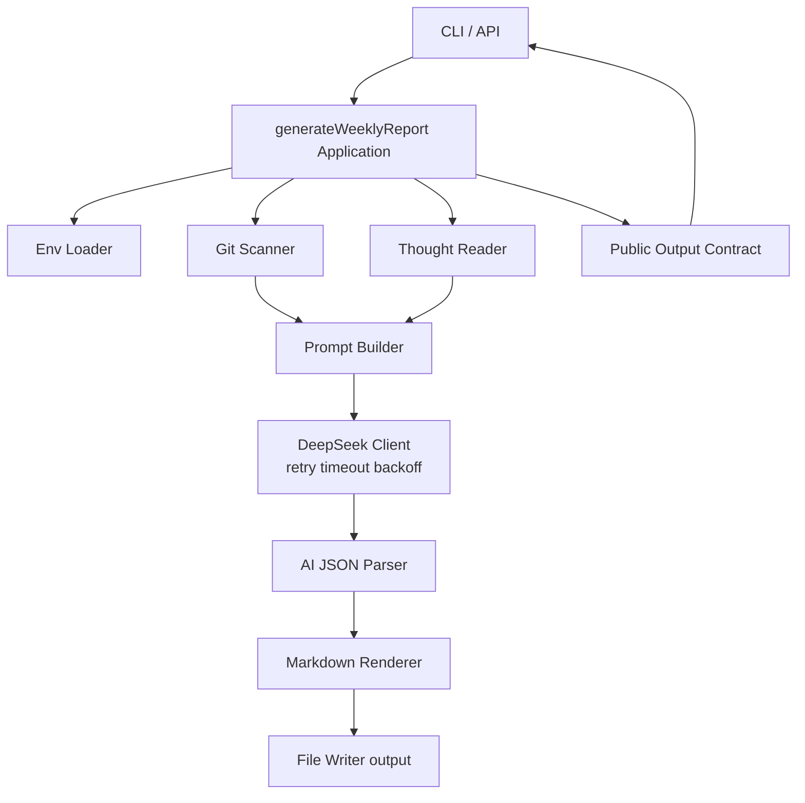

# Git-Weekly-Insight (weekly-report)

自动扫描本地多个 Git 仓库和个人笔记，调用 DeepSeek 生成结构化周报并落盘为 Markdown。

## 核心能力
- 多仓库扫描：递归识别 `WORK_DIR` 下的 Git 仓库并采集最近 N 天提交。
- 笔记整合：读取本地 `THOUGHT_PATH` 内容并融合到上下文。
- AI 结构化输出：要求模型返回 JSON，再渲染为固定 Markdown 章节。
- 可靠性：超时、重试、指数退避、结构化日志。
- 双入口：CLI（主入口）+ Next.js API 路由。

## 架构图


## 目录结构
```text
.
├─ src/app/api/weekly-report        # API 入口
├─ src/bin                          # CLI 和性能检查脚本
├─ src/lib/config                   # 环境变量加载与校验
├─ src/lib/git                      # 仓库扫描与 commit 采集
├─ src/lib/notes                    # 本地笔记读取
├─ src/lib/prompt                   # Prompt 组装
├─ src/lib/ai                       # DeepSeek 调用与重试策略
├─ src/lib/report                   # 编排、解析、渲染、输出契约
├─ src/lib/utils                    # 结构化日志
├─ src/types                        # 类型定义
├─ output                           # 生成报告目录
└─ .github/workflows                # CI/自动审查工作流
```

## 快速上手（详细）

### 1. 安装依赖
```bash
npm install
```

### 2. 配置环境变量
复制示例并填写：

```bash
# PowerShell
Copy-Item .env.example .env
```

最小必填项：
- `DEEPSEEK_API_KEY`
- `WORK_DIR`

推荐项：
- `THOUGHT_PATH`
- `SINCE_DAYS`
- `DEEPSEEK_MODEL`
- `DEEPSEEK_RETRY_COUNT`
- `DEEPSEEK_TIMEOUT_MS`
- `DEEPSEEK_BACKOFF_MS`

### 3. 先做配置自检
```bash
npm run report -- check-config
```

### 4. 预演采集（不调用 AI）
```bash
npm run report -- dry-run
```

### 5. 生成周报
```bash
npm run report -- generate
```

输出位置：
- `output/Weekly_Report_YYYY_Wxx.md`

### 6. 在任意目录使用 weekly-report 命令
当前项目支持全局命令方式。若你的系统不允许 `npm link`（Windows 常见 EPERM），可以用用户级命令 shim：

```powershell
$cmdDir = Join-Path $env:APPDATA 'npm'
if (-not (Test-Path $cmdDir)) { New-Item -ItemType Directory -Path $cmdDir | Out-Null }
$project = 'D:\Project\AI-Git-Weekly-Insight\weekly-report'
$line = 'npm --prefix "' + $project + '" run report -- %*'
Set-Content -Path (Join-Path $cmdDir 'weekly-report.cmd') -Value @('@echo off', $line) -Encoding Ascii
```

验证：
```bash
weekly-report --help
weekly-report dry-run
weekly-report
```

说明：
- `weekly-report` 无参数时默认执行 `generate`。

## API 使用
启动服务：
```bash
npm run dev
```

调用接口：
- `GET /api/weekly-report`

返回契约：
- 成功：`{ ok: true, data: WeeklyReportResult }`
- 失败：`{ ok: false, error: { message } }`

## 质量保障与测试
```bash
npm run lint
npm run test
npm run test:e2e
npm run test:e2e:api
npm run perf:check
```

说明：
- `test:e2e` 覆盖 CLI 主链路（Git fixture + AI mock + Markdown 落盘）。
- `test:e2e:api` 覆盖 API Route 主链路。
- `perf:check` 目标是采集+组装阶段小于 10 秒。

## GitHub PR 自动审查（Claude Code Action）
已提供工作流：
- `.github/workflows/claude-code-review.yml`

触发条件：
- PR 打开、同步、重新打开。

请在仓库 Secrets 中配置：
- `ANTHROPIC_API_KEY`

## 安全注意事项
- `.env` 已被 `.gitignore` 忽略，避免 API Key 泄露。
- 生成产物 `output/*.md` 默认忽略，不会自动提交。
- 推送前建议执行：

```bash
git ls-files .env
git check-ignore -v .env
```